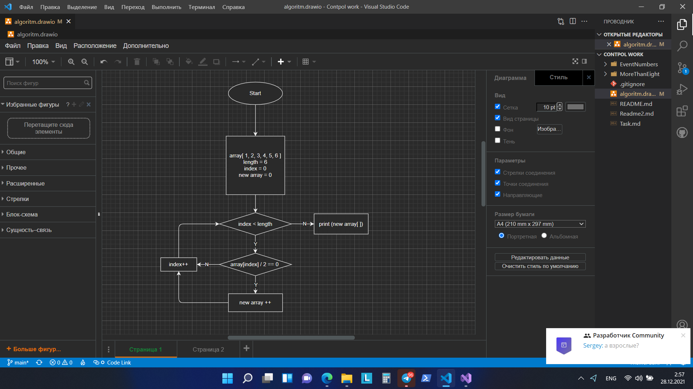

1. Создаю одномерный массив и заполняю его случайными цифрами от -10 до 10.
2. Размер массива прошу пользователя задать с клавиатуры.
3. Вывожу полученный массив на экран.
4. Для того чтобы вывести на экран четные числа массива, прошу пользователя нажать любую клавишу.
5. Начинает работать программа:
        1) Создаю метод eventArray, который принимает массив п.1 и возвращает новый массив с четными числами.
        2) Назначаю переменную eventNumber, для сохранения четных элементов массива.
        3) Назначаю переменную i, обозначающую индекс массива. 
        4) Проверяю условие, что индекс i меньше длины массива - array.Length. 
            4.1) Если условие выполняется, то проверяем следующее условие:
                - если элемент массива соотвествующего индекса после деления на два равен 0, 
                то этот элемент запоминается в eventNumber, увеличиваем индекс i на один;
                - если условие не выполняется, увеличиваем индекс i на один.
        5) По достижению условия, индекс i равен длине массива - array.Length, метод прекращает свою работу.
6. Вывожу полученный массив с четными цифрами на экран.
.