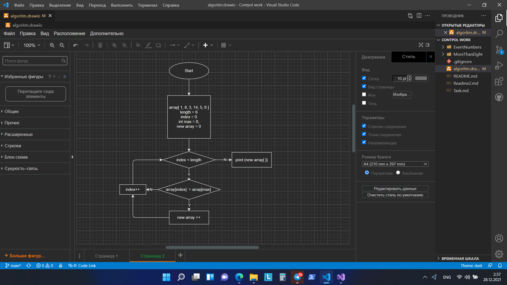

1. Создаю одномерный массив и заполняю его случайными цифрами от 0 до 20.
2. Размер массива прошу пользователя задать с клавиатуры.
3. Вывожу полученный массив на экран.
4. Число "восемь" прошу задать с клавиатуры.
5. Начинает работать программа:
        1) Создаю метод moreEightArray, который принимает массив п.1 и возвращает новый массив с числами больше 8.
        2) Назначаю переменную moreEight, для сохранения элементов массива больше 8.
        3) Назначаю переменную max, которой присваивается число, введенное пользователем.
        3) Назначаю переменную i, обозначающую индекс массива. 
        4) Проверяю условие, что индекс i меньше длины массива - array.Length. 
            4.1) Если условие выполняется, то проверяем следующее условие:
                - если элемент массива соотвествующего индекса больше, 
                max, то этот элемент запоминается в moreEight, увеличиваем индекс i на один;
                - если условие не выполняется, увеличиваем индекс i на один.
        5) По достижению условия, индекс i равен длине массива - array.Length, метод прекращает свою работу.
6. Вывожу полученный массив с цифрами больше 8 на экран.
.